# Wordpress_Red_Blue_Teaming

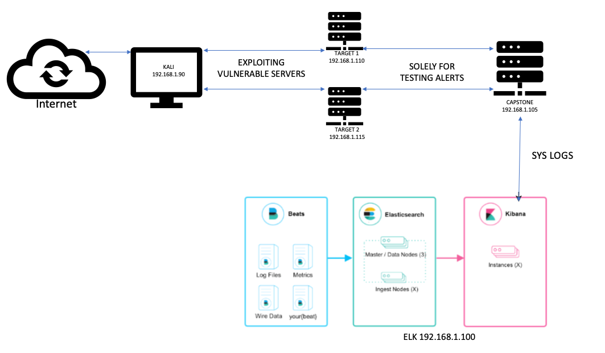

# Red Team: Summary of Operations

## Table of Contents
- Exposed Services
- Critical Vulnerabilities
- Exploitation

### Exposed Services

- Target 1
  - List of Exposed Services
     
Ports - 22/tcp - ssh
        80/tcp - http
        111/tcp - rpcbind
Nmap scan results for each machine reveal the below services and OS details:

```bash
$ nmap  -sV -sC 192.168.1.110

```
 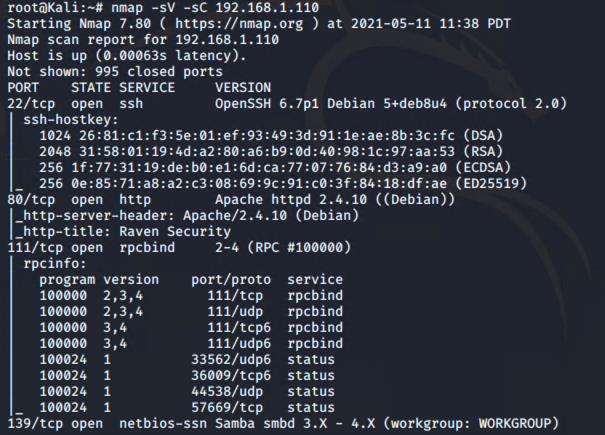
 
This scan identifies the services below as potential points of entry:
_TODO: Fill out the list below. Include severity, and CVE numbers, if possible._

The following vulnerabilities were identified on each target:
- Target 1
  - List of Critical Vulnerabilities

CVE-2008-5161 ssh remote login was active at the user level with port 22 being open
CVE-2017-7760 exposed username which allowed brute force of password information. User access to the wp-config.php file via nano. This exposed the root user and password. 

_TODO: Include vulnerability scan results to prove the identified vulnerabilities._

### Exploitation
_TODO: Fill out the details below. Include screenshots where possible._

The Red Team was able to penetrate `Target 1` and retrieve the following confidential data:
- Target 1
  - `flag1.txt`: b9bbcb33e11b80be759c4e844862482d
    - **Exploit Used** - Unprotected HTML file
      
      After logging to Target 1 as michael, looked around for a unprotected files and found the flag in service.html
                        cat /var/www/html/service.html | grep flag
            
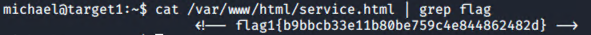

  - flag2.txt: fc3fd58dcdad9ab23faca6e9a36e581c
    - **Exploit Used**  - Remote Login with users with weak passwords
     
      Wpscan in the previous step had provided with the users that had access on the servers
 
 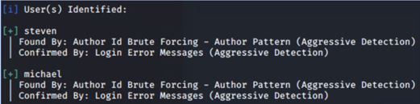
 
After obtaining the user name ‘michael’ with WPScan, an attacker can attempt to login via SSH. After several attempts with weak passwords such as ‘password’, ‘12345’, a successful login is made by using ‘michael’ as the password. 

 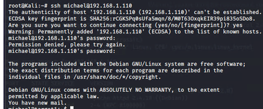

After gaining access to the server, browsed different file paths in linux and identified the flag in /var/www folder

 
 

- flag3.txt:afc01ab56b50591e7dccf93122770cd2 

 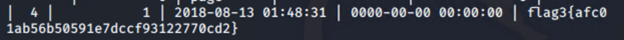

- flag4.txt: 715dea6c055b9fe3337544932f2941ce 
 
 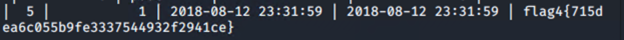
 
    - **Exploit Used** - Unprotected PHP file containing database credentials

After gaining access to the server using michael’s account, identified an unprotected file under php file under /var/www/html/wordpress

 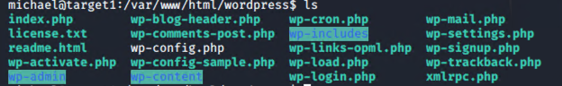

Wp-config.php file contained the credential information for the mysql database - wordpress

 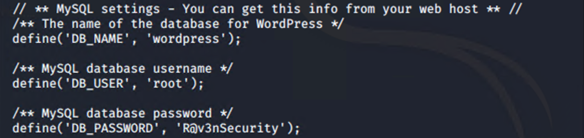 

Using the above information, logged into mysql and viewed the available databases 

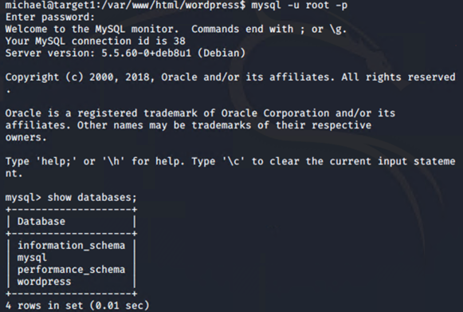 

Navigated to the “wordpress” database and perform a select query to identify the contents of the DB tables

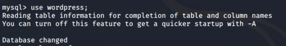 

Select query from wp_posts table displayed both flags -3 and 4

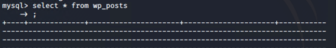 
 
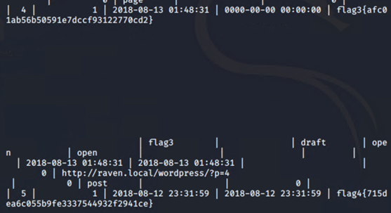 
 

flag4.txt: 715dea6c055b9fe3337544932f2941ce 
One more way to find flag 4
Exploit used -  escalating to root privileges

Navigated to wp_users table in sql to identify the hash values corresponding to michael & steven


 

Copying the hash values to a text file named - wp_hashes.txt with following format 
user1:$P$hashvalu3
user2:$P$hashvalu3

and running john the ripper against the text file

 

Using the password cracked for steven, logging to the server using steven’s credentials


 

Identified that we could run python script with Steven’s account using sudo -l command

 

Utilized the below python script to escalate to root account on the server
 
After gaining root access, navigated to root folder to find the flag 4
 

